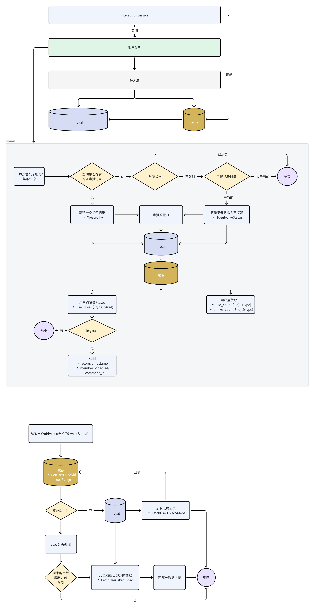

[TOC]

## 点赞功能架构
### 点赞表设计
点赞表由两张表组成：`LikeRelationModel` 记录用户对每个目标的状态（目标类型、目标 ID、status、时间），`LikeCountModel` 按目标维护 `like_count` 和 `unlike_count`，避免频繁聚合关系表。

### redis结构选择
- `user_likes:{uid}:{tarType}` 是按时间倒序存储的 zset，score 用事件时间，并设定一个长度限制。；Lua 脚本在写入时自动删掉超出长度（最旧）的条目，分页读取会拿到最新点赞。
- 计数使用`like_count:*` / `unlike_count:*`，只加不减。读取点赞数取两者之差。
- `PublishLike` 只在 zset 已存在的情况下写入，避免未命中带来的写放大；缺页时 `ListLike` 直接从 DB 拉取重建 zset，使缓存顺序与数据库一致。

### 架构简述

- 写侧：用户点赞/取消点赞事件发送到消息队列，防止高峰期事件堆积。消费者写 db 和 cache（逻辑见流程图）。写顺序不重要，如果前端急需读点赞关系可以先写 cache。
- 读侧：使用 Cache-Aside Pattern，`ListLike` 优先从 zset 列表取本页（cache hit），命中不足时到 DB 拉 `limit`+`offset` 补齐，再依次拼接视频信息，必要时把前 `UserLikesCacheLimit` 条重新写回 zset。

这种同步/异步混合方式让写操作不需等 MySQL，读操作在 Redis 命中时享受低延迟；当缓存不足，DB 补齐并在消费者里把数据重新回填，保证数据不丢失。

### 架构流程图

