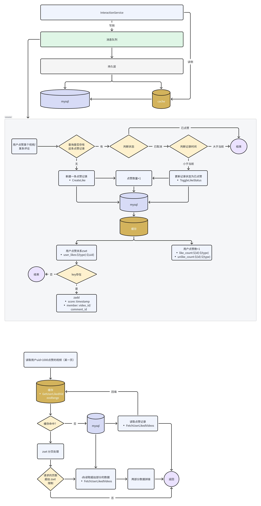

[TOC]

## 点赞功能架构
### 点赞表设计
点赞表由两张表组成：`LikeRelationModel` 记录用户对每个目标的状态（目标类型、目标 ID、status、时间），`LikeCountModel` 按目标维护 `like_count` 和 `unlike_count`，避免频繁聚合关系表。

### redis结构选择
- `user_likes:{uid}:{tarType}` 是按时间倒序存储的 zset，score 用事件时间，并设定一个长度限制。；Lua 脚本在写入时自动删掉超出长度（最旧）的条目，分页读取会拿到最新点赞。
- 计数使用`like_count:*` / `unlike_count:*`，只加不减。读取点赞数取两者之差。
- `PublishLike` 只在 zset 已存在的情况下写入，避免未命中带来的写放大；缺页时 `ListLike` 直接从 DB 拉取重建 zset，使缓存顺序与数据库一致。

### 架构简述

- 写侧：用户点赞/取消点赞事件发送到消息队列，防止高峰期事件堆积。消费者写 db 和 cache（逻辑见流程图）。写顺序不重要，如果前端急需读点赞关系可以先写 cache。
- 读侧：使用 Cache-Aside Pattern，`ListLike` 优先从 zset 列表取本页（cache hit），命中不足时到 DB 拉 `limit`+`offset` 补齐，再依次拼接视频信息，必要时把前 `UserLikesCacheLimit` 条重新写回 zset。

这种同步/异步混合方式让写操作不需等 MySQL，读操作在 Redis 命中时享受低延迟；当缓存不足，DB 补齐并在消费者里把数据重新回填，保证数据不丢失。

### 架构流程图

## Bearer令牌
- 鉴权部分使用 **双jwt** 的 bearer令牌模式。访问令牌（AccessToken）负责访问资源，刷新令牌（RefreshToken）负责过时刷新。
- 网关 api 的中间件会对包含在请求头传入的`Access-Token`解析并检查，接着将包含在令牌中的登录信息（目前仅有`uid`）包含进`context`上下文供下游的业务使用。
- 访问令牌存活时间较短，当它寿命不足时，app应请求`/auth/refresh` 刷新访问令牌。
  - 刷新操作也会生成一个新的 RefreshToken，以实现 RefreshToken 的 rotation，确保安全性。
  - 刷新操作不一定要到访问令牌过期了才调，快过期了也可以调，这个没有那么严格。缺点是会短暂出现同时有两个访问令牌有效的情况，不过正因为其寿命较短，可忽略。
  - 刷新的实现流程大致为：
    1. 解析传入的 token，即现有的 RefreshToken
       1. 解析失败，挂
       2. 过期，挂
    2. 解析出一个用户`uid`和令牌`tokenId`，服务器将`tokenId`和数据库中保存的进行比对，若不一致，挂
    3. 自此解析完毕，说明令牌有效
    4. 重新生成一个 access 和一个 refresh，注意生成 refresh的时候 `tokenId` 也要新生成，并存入db
    5. 返回两个token

### 流程图

## MFA架构
多因素身份认证（MFA）使用了市面上较流行的 Time-based One-TIme Password（TOTP）模式。需配合第三方 Authenticator App 使用，如 Google Authenticator。

### 技术细节
- totp部分借助于第三方库`github.com/pquerna/otp`，包括密钥的生成、二维码的生成和验证码校验的逻辑。
- totp校验的逻辑不仅包含了基础校验，还添加了防黑手段，主要分为**防爆破**和**防重放**技术。
  - 防爆破设计
    旨在解决校验码爆破轰炸的问题。设计一个定时请求限制（如每个用户每5分钟10次），缓存中放一个计数器并设置ttl，每次失败+1，校验前检查失败次数，如果超限制直接驳回。
  - 防重放设计（replay attack）
    旨在解决校验码重复使用的问题。每个有效的校验码的窗口期（timestep）都为30s，在**同一个窗口期内相同的校验码不允许重复提交**。缓存中记录该窗口期内的**正确**校验码，如果相同的码，视为重放攻击。

### 架构流程图
绑定阶段

验证阶段

